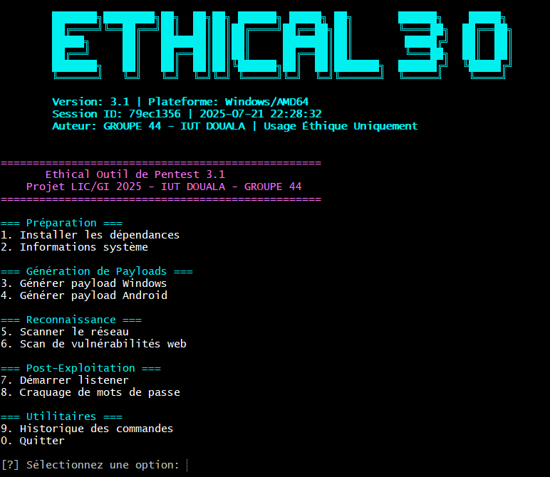
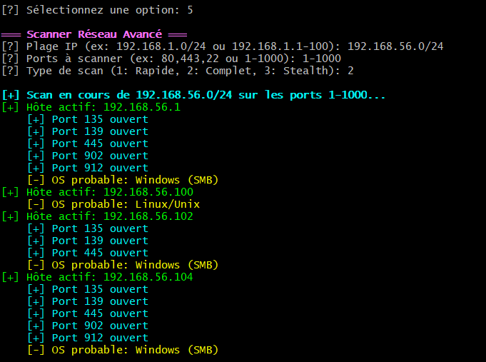

# 🛡️ ETHICAL – Framework de Pentest Éthique

<p align="center">
  
</p>

<p align="center">
  
  
  
  
</p>

<p align="center">
  <strong>Un outil complet de test d'intrusion éthique développé pour l'apprentissage et la démonstration en cybersécurité.</strong>
</p>

<p align="center">
  
  
  
</p>

---

## 🎯 Table des Matières

- [📖 Description](#-description)
- [🚀 Fonctionnalités Principales](#-fonctionnalités-principales)
- [📦 Installation](#-installation)
- [🛠️ Utilisation](#️-utilisation)
- [📌 Dépendances](#-dépendances)
- [⚠️ Avertissements Importants](#️-avertissements-importants)
- [🔐 Sécurité](#-sécurité)
- [📸 Captures d’écran](#-captures-décran)
- [🌟 Fonctionnalités Avancées](#-fonctionnalités-avancées)
- [📋 Prérequis](#-prérequis)
- [🏢 Contexte Académique](#-contexte-académique)
- [📝 Licence](#-licence)
- [🤝 Contribution](#-contribution)
- [📞 Support](#-support)
- [🙏 Remerciements](#-remerciements)

---

## 📖 Description
**ETHICAL** est un **outil de test d’intrusion**.  
Il regroupe plusieurs fonctionnalités pour **apprendre, démontrer et pratiquer** la cybersécurité dans un environnement **contrôlé et autorisé**.

⚠️ **Avertissement :**  
Usage strictement **pédagogique et légal**. Toute utilisation malveillante est interdite.  

---

## 🚀 Fonctionnalités Principales

### 🔧 Préparation & Configuration
- Installation automatique des dépendances
- Informations système détaillées
- Détection de la plateforme (Windows, Linux, macOS)
- Vérification d’autorisation via système de licence
- Gestion sécurisée des clés de chiffrement

### 🎯 Génération de Payloads
- Payload Windows avec options de furtivité
- Payload Android (basique ou injection dans APK existant)
- Signature automatique des applications
- Options de personnalisation avancées

### 🔍 Reconnaissance
- Scanner réseau avancé avec détection d’OS
- Détection d’hôtes actifs par plusieurs méthodes
- Scan de ports et grabber de bannières
- Analyse de vulnérabilités web (XSS, SQLi, fichiers sensibles)

### ⚡ Post-Exploitation
- Listener TCP multiplateforme avec shell interactif
- Transfert de fichiers (upload/download)
- Craquage de mots de passe (MD5, SHA1, dictionnaire)
- Gestion de sessions persistantes et historique des commandes

### 📊 Reporting & Utilitaires
- Base de données SQLite intégrée
- Export des résultats (JSON, CSV, HTML, TXT)
- Journalisation complète des activités
- Gestion des logs détaillée

---
## 📦 Installation

```bash
# Cloner le dépôt
git clone https://github.com/DilaneNg/Ethical.git
cd ethical

# Lancer l'installation automatique
python3 ethical.py
# Sélectionner l'option [1] pour installer les dépendances

```

## 🛠️ Utilisation
Naviguer dans le menu principal pour accéder aux fonctionnalités :

- Préparation & Configuration
- Payloads
- Reconnaissance
- Post-Exploitation
- Utilitaires & Reporting

---

## 📌 Dépendances
- cryptography
- psutil
- requests
- scapy
- beautifulsoup4
- pyinstaller
- Autres modules Python nécessaires (installés via menu)

---

## ⚠️ Avertissements Importants
- Usage strictement pédagogique et légal uniquement
- Ne jamais tester sur des systèmes sans autorisation explicite
- L’équipe décline toute responsabilité en cas d’utilisation abusive

---

## 🔐 Sécurité
- Chiffrement des données sensibles
- Historique et logs protégés
- Options de suppression sécurisée des fichiers et sessions

---

## 📸 Captures d’écran
- **Menu principal**  
  

- **Scan réseau**  
  

---

## 🌟 Fonctionnalités Avancées
- Export et analyse des résultats via CSV/JSON/HTML
- Listener TCP multiplateforme
- Historique complet des commandes et sessions
- Intégration facile dans des environnements de laboratoire sécurisé

---

## 📋 Prérequis
- Python 3.8 ou supérieur
- Modules Python (installés via menu) :  
  cryptography, psutil, requests, scapy, beautifulsoup4, pyinstaller

---

## 🏢 Contexte Académique
Développé dans le cadre de la formation en cybersécurité et tests d’intrusion.  
Objectif : **apprentissage pratique dans un environnement contrôlé et sécurisé**.

---

## 📝 Licence
Projet sous **licence MIT** (modifiable selon choix).  
Usage strictement pédagogique.

---

## 🤝 Contribution
- Suggestions et améliorations via Pull Requests
- Signalement des bugs via Issues GitHub

---

## 📞 Support
- Email : `binaire.technologie@gmail.com`

---

## 🙏 Remerciements
- La communauté open-source en cybersécurité  

